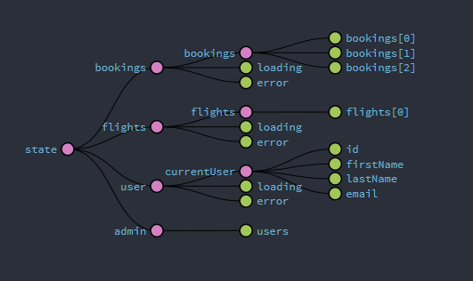
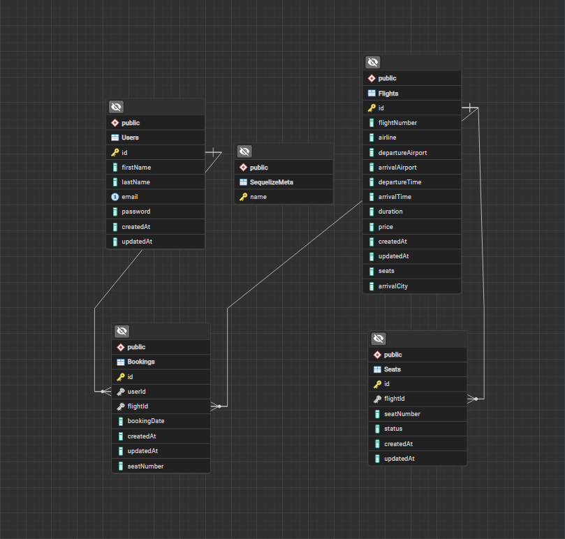

# Bifröst Bookings

## Introduction

Welcome to **Bifröst Bookings** – your gateway to seamless flight reservations! Inspired by the legendary rainbow bridge from Norse mythology, Bifröst, this app bridges the gap between travelers and their dream destinations with ease and efficiency.

## Tech Stack

- **Frontend:** React, Redux
- **Backend:** Node.js, Express
- **Database:** PostgreSQL
- **APIs:** Weatherbit API (for weather data)

## Project Architecture

### Redux State Management

### Database ERD

## Current Features

- **User Authentication:** Secure registration and login.
- **User Profiles:** Manage your bookings and edit details.
- **Flight Search:** Search for flights by departure city, arrival city, dates, and passenger count.
- **Booking Management:** Perform basic CRUD operations on your bookings.

## Currently Working On

- **Admin Dashboard:** Developing a comprehensive panel for managing flights, bookings, and users.
- **Enhanced Search:** Improving search functionality for more accurate results. Currently, the app uses randomly generated flight data for flights from Canada and the United States. Future enhancements will explore options like the Amadeus API to provide real, accurate flight information.
- **UI/UX Enhancements:** Continuously refining design and usability for an improved user experience (CSS wizards, tips are welcome -\_-).

## Future Ideas

- **Multi-language Support:** Expanding to include multiple languages.
- **Mobile Application:** Developing a mobile app version of Bifröst Bookings.
- **Notifications:** Adding features for timely flight and booking alerts.

---

### Note

This project is built for personal learning purposes. While I'm passionate about developing **Bifröst Bookings**, I don't plan to take it into full production. It's a playground for honing my skills and exploring new technologies at the moment.

---

## Credits

Background images: 
- [r3dmax](https://unsplash.com/@r3dmax) on Unsplash
- [theoeilertsen](https://unsplash.com/@theoeilertsen) on Unsplash
- [chrismarquardt](https://unsplash.com/@chrismarquardt) on Unsplash
- [dpascoa](https://unsplash.com/@dpascoa) on Unsplash
- [cikstefan](https://unsplash.com/@cikstefan) on Unsplash

